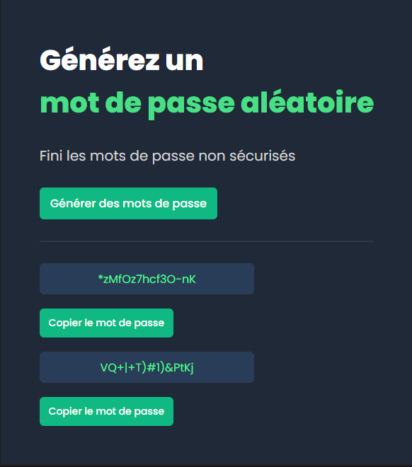

# Password Generator - Scrimba Project
This is a solution to the [Password Generator Solo Project on Scrimba](https://scrimba.com/learn/learnjavascript/solo-project-password-generator-cR9B46Sg). 

### Screenshot

### Links

- Solution URL: https://clementbartholome.github.io/Password-Generator-Scrimba-Project/ 
- Scrimba "Learn JavaScript for free" course: https://scrimba.com/learn/learnjavascript

### Built with

- HTML5 
- CSS (Flexbox, CSS Grid, Media Queries...)
- JavaScript

### What I learned

This project made me practice DOM manipulation, functions, for loops, array manipulation... It's obviously a small project, but I think it's a great step in my journey to learn JavaScript. 

### Continued development

DONE - I plan to add a functionality to specify the length of the passwords generated. 

### Useful resources

- [Scrimba](https://scrimba.com/dashboard#overview) - The source of this project.
- [freeCodeCamp](https://www.freecodecamp.org/learn/) - Another ressource I used to learn HTML, CSS, JS and more for free. 
- [W3Schools](https://www.w3schools.com/howto/howto_css_animate_buttons.asp) - The source of the  onclick "ripple" effect I added on this project.

## Author

- LinkedIn - [Clément Bartholomé](https://www.linkedin.com/in/clementbartholome/)
- Frontend Mentor - [@ClementBartholome](https://www.frontendmentor.io/profile/ClementBartholome)
